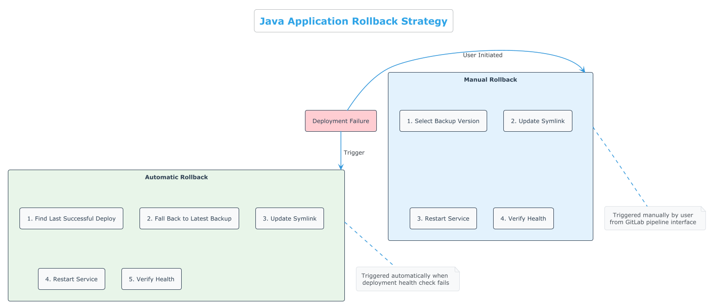

# Java Pipeline Enhancements

This guide provides optional enhancements for the Java deployment pipeline. These are modular additions you can implement when your team is ready for more advanced features.


*Figure 1: Detailed Java application deployment process flow*

## Security Scanning

Add basic security scanning for Java dependencies:

1. Create a new file `ci/security.yml`:
```yaml
# Java-specific security scanning
dependency_check:
  stage: security
  image: owasp/dependency-check:latest
  script:
    - /usr/share/dependency-check/bin/dependency-check.sh --scan . --format "ALL" --project "${APP_NAME}" --out "reports"
  artifacts:
    paths:
      - reports/
  allow_failure: true
  when: manual
```

2. Include it in your `.gitlab-ci.yml`:
```yaml
include:
  - local: '/ci/variables.yml'
  - local: '/ci/functions.yml'
  - local: '/ci/build.yml'
  - local: '/ci/deploy.yml'
  - local: '/ci/rollback.yml'
  - local: '/ci/notify.yml'
  - local: '/ci/security.yml'  # Add this line
```

## Java Code Quality

Add SonarQube analysis for Java code quality:

1. Create a new file `ci/quality.yml`:
```yaml
sonarqube:
  stage: quality
  image: $BUILDER_IMAGE_JAVA_21
  variables:
    SONAR_HOST_URL: "https://sonar.example.com"
    SONAR_TOKEN: ${SONAR_API_TOKEN}
  script:
    - $CI_PROJECT_DIR/mvnw sonar:sonar -Dsonar.projectKey=${APP_NAME} -Dsonar.host.url=${SONAR_HOST_URL} -Dsonar.login=${SONAR_TOKEN}
  allow_failure: true
  when: manual
```

2. Add the quality stage to your `.gitlab-ci.yml`:
```yaml
stages:
  - validate
  - security
  - quality  # Add this line
  - build
  - deploy
  - notify
  - rollback
```

## Java Performance Testing

Add JMeter-based performance testing:

1. Create a new file `ci/performance.yml`:
```yaml
performance_test:
  stage: test
  image: justb4/jmeter:5.4
  script:
    - /entrypoint.sh -n -t performance/test-plan.jmx -l results.jtl -e -o report
  artifacts:
    paths:
      - report/
  when: manual
```

2. Create a basic JMeter test plan in `performance/test-plan.jmx`

## Artifact Versioning

Enhance artifact versioning for better traceability:

1. Update `ci/variables.yml`:
```yaml
variables:
  # Dynamic version based on Git
  APP_VERSION: "${CI_COMMIT_REF_NAME}-${CI_COMMIT_SHORT_SHA}"
  
  # Artifact path with versioning
  ARTIFACT_PATH: "target/${APP_NAME}-${APP_VERSION}.jar"
  ARTIFACT_NAME: "${APP_NAME}-${APP_VERSION}.jar"
```

## Multi-JVM Support

Add support for testing with multiple JDK versions:

1. Create a new file `ci/multi-jdk.yml`:
```yaml
.build_java_8:
  extends: .build_template
  image: maven:3.8-openjdk-8
  variables:
    JAVA_VERSION: "8"

.build_java_11:
  extends: .build_template
  image: maven:3.8-openjdk-11
  variables:
    JAVA_VERSION: "11"

.build_java_17:
  extends: .build_template
  image: maven:3.8-openjdk-17
  variables:
    JAVA_VERSION: "17"

build_all_jdks:
  stage: build
  trigger:
    include: ci/multi-jdk-pipeline.yml
  when: manual
```

## Database Migration Support

Add support for database migrations during deployment:


*Figure 2: Automatic and manual rollback strategies*

1. Update `ci/functions.yml` with a new function:
```yaml
function perform_db_migration() {
  log "INFO" "Running database migration"
  
  if is_test_mode; then
    log "TEST" "Would execute database migration"
    return 0
  fi
  
  # For Flyway using Maven Wrapper
  ssh_cmd "cd ${CURRENT_LINK} && ./mvnw flyway:migrate -Dflyway.url=${DB_URL} -Dflyway.user=${DB_USER} -Dflyway.password=${DB_PASSWORD}"
  
  # For Liquibase using Maven Wrapper
  # ssh_cmd "cd ${CURRENT_LINK} && ./mvnw liquibase:update -Dliquibase.url=${DB_URL} -Dliquibase.username=${DB_USER} -Dliquibase.password=${DB_PASSWORD}"
  
  return $?
}
```

2. Update the deployment process in `ci/deploy.yml` to include database migration:
```yaml
echo "=== STEP 8: Running database migration ==="
perform_db_migration || { echo "Failed to run database migration"; return 1; }
```

## Service Health Dashboard

Add a simple health dashboard for your Java services:

1. Create a new file `ci/dashboard.yml`:
```yaml
pages:
  stage: deploy
  script:
    - mkdir -p public
    - echo "<html><head><title>${APP_NAME} Status</title></head><body>" > public/index.html
    - echo "<h1>${APP_NAME} Status Dashboard</h1>" >> public/index.html
    - echo "<p>Last deployment: $(date)</p>" >> public/index.html
    - echo "<p>Environment: ${CI_ENVIRONMENT_NAME}</p>" >> public/index.html
    - echo "<p>Version: ${APP_VERSION}</p>" >> public/index.html
    - echo "<p>Commit: ${CI_COMMIT_SHORT_SHA}</p>" >> public/index.html
    - echo "<p><a href='${HEALTH_CHECK_URL}'>Health Check</a></p>" >> public/index.html
    - echo "</body></html>" >> public/index.html
  artifacts:
    paths:
      - public
  only:
    - main
```

## Advanced Testing Framework

Enhance your pipeline with a comprehensive testing framework that validates all aspects of your deployment process:



*Figure 3: Comprehensive testing of deployment and rollback functionality*

1. Create a robust testing environment in your `/tests` directory:

```bash
# Structure your tests directory like this
tests/
  ├── test_pipeline.sh               # Basic pipeline structure testing
  ├── test_systemd_rollback.sh       # Systemd service and rollback testing
  ├── comprehensive_pipeline_test.sh  # Complete pipeline validation
  ├── convert_to_extends.sh          # YAML anchor to extends conversion
  └── README.md                      # Testing documentation
```

2. For comprehensive testing, add a container-based systemd test environment:

```yaml
# Add to ci/testing.yml
systemd_test:
  stage: test
  image: docker:20
  services:
    - docker:20-dind
  variables:
    DOCKER_TLS_CERTDIR: ""
  script:
    - docker run --privileged --rm -v "/sys/fs/cgroup:/sys/fs/cgroup:rw" -v "$CI_PROJECT_DIR:/test" registry.access.redhat.com/ubi9/ubi:latest /bin/bash -c "cd /test && ./tests/comprehensive_pipeline_test.sh"
  when: manual
```

3. Add a template for testing multi-server deployments:

```yaml
# Add to ci/testing.yml
.multi_server_test:
  script:
    - export DEPLOY_HOSTS='["server1.example.com", "server2.example.com", "server3.example.com"]'
    - export MULTI_SERVER_DEPLOYMENT="true"
    - ./tests/comprehensive_pipeline_test.sh
  when: manual
```

4. Implement edge case testing for service failures and recoveries:

```bash
# Inside your comprehensive test script
function test_service_failure() {
  # Simulate service failure
  systemctl stop ${APP_NAME}.service
  
  # Verify automatic rollback triggers
  # ...
}
```

The testing framework ensures that "the files we want to ship are the files under test, with no divergence from that end state."

## How to Implement

These enhancements are designed to be modular. You can implement them one at a time as your team's needs evolve:

1. Start with the basic pipeline from the JAVA_QUICK_START.md guide
2. Choose the enhancements that provide the most value for your team
3. Implement them one at a time, testing each addition
4. Consider adding the comprehensive testing framework early in your implementation
5. Document which enhancements you've added to your pipeline

This approach allows you to gradually improve your pipeline without overwhelming your team with complexity.
