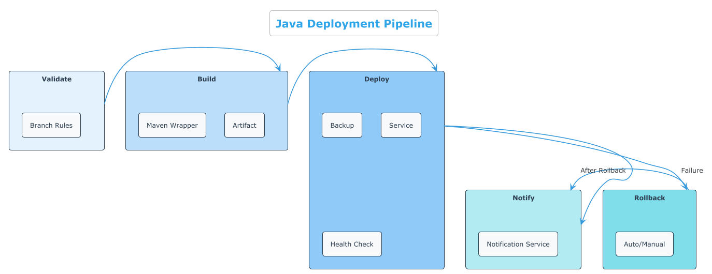
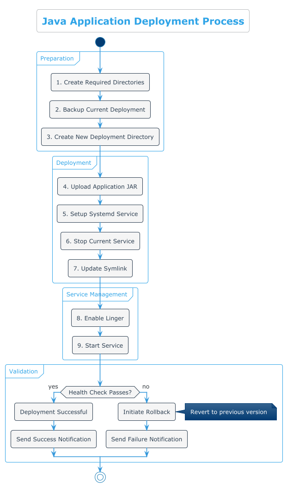
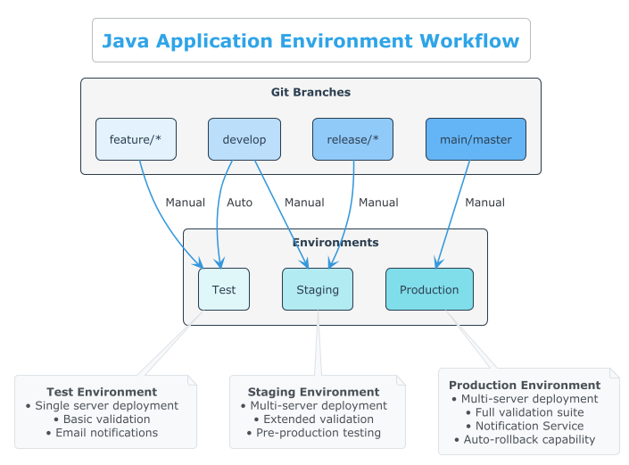

# Java Application Deployment Pipeline

A modular, multi-environment GitLab CI/CD pipeline for Java application deployment with automated rollback capabilities.



## Overview

This repository contains a GitLab CI/CD configuration specifically designed for deploying Java applications to multiple environments (test, staging, production) with comprehensive deployment, rollback, and notification capabilities. The pipeline is designed to be modular, maintainable, and follows GitLab CI/CD best practices for Java applications deployed as systemd services.

## Pipeline Structure

The CI/CD pipeline is organized into the following stages:

1. **Validate**: Ensures deployments only occur from protected branches
2. **Build**: Compiles and packages the Java application
3. **Deploy**: Deploys the application to the target environment
4. **Notify**: Sends notifications about deployment success/failure
5. **Rollback**: Handles automatic and manual rollbacks if needed



*The diagram above illustrates the Java application deployment process, from preparation through validation.*

## Directory Structure

```
.
├── .gitlab-ci.yml           # Main CI/CD configuration file
└── ci/                      # Modular CI components
    ├── variables.yml        # Global and environment-specific variables
    ├── functions.yml        # Reusable shell functions
    ├── build.yml            # Build job templates
    ├── deploy.yml           # Deployment job templates
    ├── rollback.yml         # Rollback job templates
    └── notify.yml           # Notification job templates
```

## Environment Support

The pipeline supports three environments with multi-server deployment capabilities:



*The diagram above shows how Git branches map to deployment environments with appropriate controls.*

1. **Test**
   - Single server deployment: `test-server.example.com`
   - Manual deployments from `develop` branch and feature branches
   - Customised for testing purposes
   - Auto-promotion prevention enabled

2. **Staging**
   - Multi-server deployment: `staging-server-1.example.com`, `staging-server-2.example.com`
   - Manual deployments from `develop` or `release/*` branches
   - Uses `staging-appuser` for deployment
   - Auto-promotion prevention enabled

3. **Production**
   - Multi-server deployment: `production-server-1.example.com`, `production-server-2.example.com`
   - Manual deployments from `main`, `master`, or `production` branches
   - Uses `prod-appuser` for deployment
   - Notification Service enabled
   - Auto-promotion prevention enabled

## Features

- **Modular Design**: Pipeline components are separated into reusable, maintainable files
- **Java-Specific Configuration**: Optimized for Java applications with Maven/Gradle support
- **Multi-Environment Support**: Configured for test, staging, and production environments
- **Multi-Server Deployment**: Deploy to multiple servers within an environment
- **Auto-Promotion Prevention**: Ensure deployments are manually triggered between environments
- **Robust Error Handling**: Comprehensive logging and error recovery
- **Test Mode**: Simulate pipeline execution without making actual changes
- **Automated Rollback**: Recover from failed deployments automatically
- **Manual Rollbacks**: On-demand rollback capability for each environment
- **Deployment Retention**: Configurable number of deployments to retain
- **Health Checks**: Validates deployment success with configurable retries
- **Notifications**: Flexible notification system supporting email and Notification Service
- **Detailed Logging**: Comprehensive logging with timestamps and log levels

## Rollback Mechanism

The pipeline includes both automatic and manual rollback capabilities:


*The diagram above illustrates the automatic and manual rollback strategies with comprehensive testing.*

- **Automatic Rollback**: Triggered when deployment health checks fail
- **Manual Rollback**: Can be triggered manually for any environment

Rollbacks follow a consistent process:

1. Identify the appropriate rollback target (last successful deployment or latest backup)
2. Stop the current service
3. Update the symlink to point to the rollback target
4. Start the service
5. Perform health checks to verify the rollback was successful

## SSH Authentication

The pipeline uses `sshpass` for SSH authentication. All SSH commands are wrapped in functions that handle authentication consistently:

```bash
function ssh_cmd() {
  sshpass $sshpass ssh ${APP_USER}@$DEPLOY_HOST "$@"
}
```

## Java Application Support

This pipeline is specifically designed for Java applications deployed as systemd services:

- **Java-Optimized**: Configured for Java applications with JVM options and classpath handling
- **Maven/Gradle Support**: Works with both Maven and Gradle build systems
- **JAR Deployment**: Handles JAR file deployment with proper versioning
- **JVM Configuration**: Configurable JVM options for different environments
- **Systemd Integration**: Creates and manages systemd services for Java applications

### Default Java Configuration

```yaml
variables:
  # Application details
  APP_NAME: "my-java-app"
  APP_VERSION: "1.0.0"
  
  # Build configuration (Maven)
  BUILD_COMMAND: "./mvnw clean package -DskipTests"
  
  # Artifact settings
  ARTIFACT_PATH: "target/my-java-app-1.0.0.jar"
  ARTIFACT_NAME: "my-java-app-1.0.0.jar"
  
  # Java runtime configuration
  RUNTIME_PATH: "/usr/bin/java"
  RUNTIME_OPTS: "-Xmx512m -Dspring.profiles.active=${CI_ENVIRONMENT_NAME}"
  
  # Service configuration
  START_COMMAND: "/usr/bin/java -Xmx512m -jar /opt/app/current/my-java-app-1.0.0.jar"
  WORKING_DIRECTORY: "/opt/app/current"
  SERVICE_ENV_VARS: "JAVA_HOME=/usr/lib/jvm/java-17-openjdk,SPRING_PROFILES_ACTIVE=${CI_ENVIRONMENT_NAME}"
```

### Java Deployment Process

The deployment process is optimized for Java applications:


*The diagram above shows the detailed steps in the Java application deployment process.*

1. **Build**: Executes Maven or Gradle to build the Java application
2. **Artifact Collection**: Collects the JAR file(s) from the target directory
3. **Upload**: Transfers the JAR file to the deployment server
4. **Service Configuration**: Creates a systemd service with appropriate Java options
5. **Health Check**: Validates the application is running correctly

### For Other Application Types

While this pipeline is optimized for Java applications, it can be adapted for other application types by modifying the build, artifact, and service configuration. See the GENERIC_ADAPTATION.md file for guidance on adapting this pipeline for other application types.

## Multi-Server Deployment

The pipeline supports deploying to multiple servers within a single environment:

- **Configuration**: Set `MULTI_SERVER_DEPLOYMENT: "true"` and define servers in the `DEPLOY_HOSTS` array
- **Sequential Deployment**: Servers are deployed to one after another
- **Validation**: Each server must pass health checks before proceeding to the next
- **Fallback**: If multi-server mode is disabled, falls back to single server (`DEPLOY_HOST`)
- **Error Handling**: If deployment fails on any server, the entire job fails
- **Testing**: Comprehensive testing validates multi-server deployment and rollback

### Example Configuration

```yaml
variables:
  MULTI_SERVER_DEPLOYMENT: "true"
  DEPLOY_HOSTS: '["server1.example.com", "server2.example.com"]'
  DEPLOY_HOST: "server1.example.com"  # Fallback for single-server mode
```

## Auto-Promotion Prevention

To ensure controlled deployments and comply with the May 2025 GitLab protected branch updates:

- **Manual Approval**: All environment promotions require manual approval
- **Configuration**: Set `AUTO_PROMOTION: "false"` in environment variables
- **Branch Protection**: Works with GitLab's protected branch rules
- **Safety Check**: Pipeline validates that deployments are manually triggered
- **Compliance**: Helps maintain compliance with TADS CO-014-04 standards

### Example Configuration

```yaml
variables:
  AUTO_PROMOTION: "false"  # Prevents automatic promotion between environments
```

## Deployment Process

1. Validate branch permissions and auto-promotion settings
2. Build the application
3. Create deployment directories
4. Backup current deployment
5. Upload application JAR
6. Configure systemd service
7. Update symlinks for atomic deployment
8. Start the service
9. Perform health checks
10. Clean up old deployments
11. Send notifications

## Testing

The pipeline includes a comprehensive testing framework to ensure it works correctly in all environments:

- **Principle**: "The files we want to ship are the files under test, with no divergence from that end state"
- **Scripts**: Multiple test scripts with increasing levels of coverage (see `/tests` directory)
- **Components**:
  - Basic pipeline structure validation using gitlab-ci-local
  - systemd service testing with rollback functionality
  - Multi-server deployment simulation
  - Edge case handling for service failures
- **Containers**: Tests run in Podman containers with systemd support to simulate real environments
- **Comprehensive Coverage**: All aspects of the pipeline are tested, including deployment, rollback, and service management

See the [tests/README.md](tests/README.md) for detailed information about the testing approach.

- **Production**: `main`, `master`, `production`

## Usage

### Prerequisites

- GitLab CI/CD runner with shell executor
- SSH access to deployment servers
- Java 17 installed on deployment servers
- Maven for building the application

### Customisation

1. Update server hostnames in `ci/variables.yml`
2. Configure environment-specific variables as needed
3. Adjust branch rules in the deployment jobs if necessary
4. Set up notification preferences

## Best Practices Implemented

- Modular configuration using `include`
- Template inheritance with `extends`
- Environment-specific configurations
- Reusable shell functions
- Atomic deployments
- Health validation
- Automated rollbacks
- Retention policies

## Security Considerations

- Protected variables for sensitive information
- User-specific deployments
- Systemd service isolation
- Branch protection rules

## Troubleshooting

If deployments fail:

1. Check the job logs for specific error messages
2. Verify SSH connectivity to the deployment server
3. Ensure the health check endpoint is properly configured
4. Check systemd service logs on the deployment server

## Licence

[MIT Licence](LICENSE)
