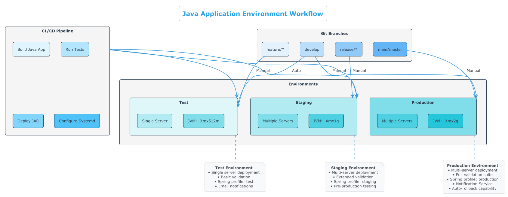

# Java Application Deployment Pipeline

A modular, multi-environment GitLab CI/CD pipeline specifically designed for Java application deployment with automated rollback capabilities.


## Table of Contents

- [Overview](#overview)
- [Quick Start Guide](#quick-start-guide)
- [Pipeline Structure](#pipeline-structure)
- [Environment Support](#environment-support)
- [Features](#features)
- [Rollback Mechanism](#rollback-mechanism)
- [SSH Authentication](#ssh-authentication)
- [Java Application Support](#java-application-support)
- [Multi-Server Deployment](#multi-server-deployment)
- [Auto-Promotion Prevention](#auto-promotion-prevention)
- [Testing Framework](#testing-framework)
- [Deployment Process](#deployment-process)

## Overview

This repository contains a GitLab CI/CD configuration specifically designed for deploying Java applications to multiple environments (test, staging, production) with comprehensive deployment, rollback, and notification capabilities. The pipeline is designed to be modular, maintainable, and follows GitLab CI/CD best practices for Java applications deployed as systemd services.

## Quick Start Guide

This section will help you quickly set up the GitLab CI/CD pipeline for your Java application.

### Basic Setup (5 minutes)

1. **Copy the Files**: Copy the `.gitlab-ci.yml` and `ci/` directory to your Java project root.

2. **Update Essential Variables**: Edit `ci/variables.yml` and update these key variables:
   ```yaml
   variables:
     # Application name (used for deployment directories and service names)
     APP_NAME: "your-java-app"
     
     # Deployment server hostname or IP address
     DEPLOY_HOST: "your-server.example.com"
     
     # User account on deployment servers
     APP_USER: "your-app-user"
     
     # Email for notifications
     NOTIFICATION_EMAIL: "your-team@example.com"
   ```

3. **Commit and Push**: Commit these changes and push to your GitLab repository.

4. **Run the Pipeline**: Go to CI/CD > Pipelines in GitLab and run your first pipeline.

That's it! Your Java application will be built and deployed using the pipeline.

### Common Java Customizations

#### Maven Repository Configuration

The internal Maven Wrapper is configured to use a local repository within the project:

```yaml
variables:
  MAVEN_OPTS: "-Dmaven.repo.local=$CI_PROJECT_DIR/.m2/repository"
```

#### Maven Wrapper Build Options

The pipeline uses an internal Maven Wrapper component for consistent builds. Make sure the Maven Wrapper script has the correct permissions in your repository:

```bash
git update-index --chmod=+x mvnw
```

Default (skip tests):
```yaml
BUILD_COMMAND: "$CI_PROJECT_DIR/mvnw package -DskipTests"
```

With tests:
```yaml
BUILD_COMMAND: "$CI_PROJECT_DIR/mvnw package"
```

With specific profile:
```yaml
BUILD_COMMAND: "$CI_PROJECT_DIR/mvnw package -P production -DskipTests"
```

#### Java Runtime Options

Default:
```yaml
RUNTIME_OPTS: "-Xmx512m -Xms256m"
```

For larger applications:
```yaml
RUNTIME_OPTS: "-Xmx2g -Xms1g -XX:+UseG1GC"
```

With system properties:
```yaml
RUNTIME_OPTS: "-Xmx512m -Dspring.profiles.active=${CI_ENVIRONMENT_NAME} -Dserver.port=8080"
```

#### JDK Version

```yaml
# In .gitlab-ci.yml, update the build job:
build:
  extends: .build_template
  image: $BUILDER_IMAGE_JAVA_21  # Reference your internal builder image
```

## Pipeline Structure

The CI/CD pipeline is organized into the following stages:

| Stage | Purpose | Key Features |
|-------|---------|-------------|
| **Validate** | Ensures deployments only occur from protected branches | • Branch protection rules<br>• Auto-promotion prevention<br>• Environment validation |
| **Build** | Compiles and packages the Java application | • Maven/Gradle support<br>• Artifact collection<br>• Dependency caching |
| **Deploy** | Deploys the application to the target environment | • Multi-server support<br>• Systemd service creation<br>• Health checks |
| **Notify** | Sends notifications about deployment status | • Email notifications<br>• Notification Service integration<br>• Detailed status reports |
| **Rollback** | Handles automatic and manual rollbacks if needed | • Automatic failure detection<br>• Version history management<br>• One-click manual rollback |


*The diagram above illustrates the Java application deployment pipeline stages and their relationships.*

### Deployment Process Visualization


*The diagram above illustrates the Java application deployment process, from preparation through validation. It shows the step-by-step flow of how Java artifacts are deployed to target environments.*

## Directory Structure

```
.
├── .gitlab-ci.yml           # Main CI/CD configuration file
└── ci/                      # Modular CI components
    ├── variables.yml        # Global and environment-specific variables
    ├── functions.yml        # Reusable shell functions
    ├── build.yml            # Build job templates
    ├── deploy.yml           # Deployment job templates
    ├── rollback.yml         # Rollback job templates
    └── notify.yml           # Notification job templates
```

## Environment Support

The pipeline supports three environments with multi-server deployment capabilities:

### Environment Workflow Visualization



*The diagram above shows how Git branches map to deployment environments with appropriate controls. It illustrates the flow from development through test, staging, and production environments.*

1. **Test**
   - Single server deployment: `test-server.example.com`
   - Manual deployments from `develop` branch and feature branches
   - Customised for testing purposes
   - Auto-promotion prevention enabled

2. **Staging**
   - Multi-server deployment: `staging-server-1.example.com`, `staging-server-2.example.com`
   - Manual deployments from `develop` or `release/*` branches
   - Uses `staging-appuser` for deployment
   - Auto-promotion prevention enabled

3. **Production**
   - Multi-server deployment: `production-server-1.example.com`, `production-server-2.example.com`
   - Manual deployments from `main`, `master`, or `production` branches
   - Uses `prod-appuser` for deployment
   - Notification Service enabled
   - Auto-promotion prevention enabled

## Features

- **Modular Design**: Pipeline components are separated into reusable, maintainable files
- **Java-Specific Configuration**: Optimized for Java applications with Maven/Gradle support
- **Multi-Environment Support**: Configured for test, staging, and production environments
- **Multi-Server Deployment**: Deploy to multiple servers within an environment
- **Auto-Promotion Prevention**: Ensure deployments are manually triggered between environments
- **Robust Error Handling**: Comprehensive logging and error recovery
- **Test Mode**: Simulate pipeline execution without making actual changes
- **Automated Rollback**: Recover from failed deployments automatically
- **Manual Rollbacks**: On-demand rollback capability for each environment
- **Deployment Retention**: Configurable number of deployments to retain
- **Health Checks**: Validates deployment success with configurable retries
- **Notifications**: Flexible notification system supporting email and Notification Service
- **Detailed Logging**: Comprehensive logging with timestamps and log levels

## Rollback Mechanism

The pipeline includes both automatic and manual rollback capabilities:

### Rollback Strategy Visualization


*The diagram above illustrates the automatic and manual rollback strategies with comprehensive testing. It shows how the system detects deployment failures and initiates rollbacks to maintain service availability.*

- **Automatic Rollback**: Triggered when deployment health checks fail
- **Manual Rollback**: Can be triggered manually for any environment

Rollbacks follow a consistent process:

1. Identify the appropriate rollback target (last successful deployment or latest backup)
2. Stop the current service
3. Update the symlink to point to the rollback target
4. Start the service
5. Perform health checks to verify the rollback was successful

## SSH Authentication

The pipeline uses `sshpass` for SSH authentication. All SSH commands are wrapped in functions that handle authentication consistently:

```bash
function ssh_cmd() {
  sshpass $sshpass ssh ${APP_USER}@$DEPLOY_HOST "$@"
}
```

## Java Application Support

This pipeline is specifically designed for Java applications deployed as systemd services:

- **Java-Optimized**: Configured for Java applications with JVM options and classpath handling
- **Maven/Gradle Support**: Works with both Maven and Gradle build systems
- **JAR Deployment**: Handles JAR file deployment with proper versioning
- **JVM Configuration**: Configurable JVM options for different environments
- **Systemd Integration**: Creates and manages systemd services for Java applications

### Default Java Configuration

```yaml
variables:
  # Application details
  APP_NAME: "my-java-app"
  APP_VERSION: "1.0.0"
  
  # Build configuration (Maven)
  BUILD_COMMAND: "./mvnw clean package -DskipTests"
  
  # Artifact settings
  ARTIFACT_PATH: "target/my-java-app-1.0.0.jar"
  ARTIFACT_NAME: "my-java-app-1.0.0.jar"
  
  # Java runtime configuration
  RUNTIME_PATH: "/usr/bin/java"
  RUNTIME_OPTS: "-Xmx512m -Dspring.profiles.active=${CI_ENVIRONMENT_NAME}"
  
  # Service configuration
  START_COMMAND: "/usr/bin/java -Xmx512m -jar /opt/app/current/my-java-app-1.0.0.jar"
  WORKING_DIRECTORY: "/opt/app/current"
  SERVICE_ENV_VARS: "JAVA_HOME=/usr/lib/jvm/java-17-openjdk,SPRING_PROFILES_ACTIVE=${CI_ENVIRONMENT_NAME}"
```

### Java Deployment Process

The deployment process is optimized for Java applications:


*The diagram above shows the detailed steps in the Java application deployment process.*

1. **Build**: Executes Maven or Gradle to build the Java application
2. **Artifact Collection**: Collects the JAR file(s) from the target directory
3. **Upload**: Transfers the JAR file to the deployment server
4. **Service Configuration**: Creates a systemd service with appropriate Java options
5. **Health Check**: Validates the application is running correctly

### For Other Application Types

While this pipeline is optimized for Java applications, it can be adapted for other application types by modifying the build, artifact, and service configuration. See the GENERIC_ADAPTATION.md file for guidance on adapting this pipeline for other application types.

## Multi-Server Deployment

The pipeline supports deploying to multiple servers within a single environment:

- **Configuration**: Set `MULTI_SERVER_DEPLOYMENT: "true"` and define servers in the `DEPLOY_HOSTS` array
- **Sequential Deployment**: Servers are deployed to one after another
- **Validation**: Each server must pass health checks before proceeding to the next
- **Fallback**: If multi-server mode is disabled, falls back to single server (`DEPLOY_HOST`)
- **Error Handling**: If deployment fails on any server, the entire job fails
- **Testing**: Comprehensive testing validates multi-server deployment and rollback

### Example Configuration

```yaml
variables:
  MULTI_SERVER_DEPLOYMENT: "true"
  DEPLOY_HOSTS: '["server1.example.com", "server2.example.com"]'
  DEPLOY_HOST: "server1.example.com"  # Fallback for single-server mode
```

## Auto-Promotion Prevention

To ensure controlled deployments and comply with the May 2025 GitLab protected branch updates:

- **Manual Approval**: All environment promotions require manual approval
- **Configuration**: Set `AUTO_PROMOTION: "false"` in environment variables
- **Branch Protection**: Works with GitLab's protected branch rules
- **Safety Check**: Pipeline validates that deployments are manually triggered
- **Compliance**: Helps maintain compliance with TADS CO-014-04 standards

### Example Configuration

```yaml
variables:
  AUTO_PROMOTION: "false"  # Prevents automatic promotion between environments
```

## Testing Framework

Our comprehensive testing framework ensures that the pipeline works correctly in all scenarios:

### Testing Framework Visualization


*The diagram above illustrates the comprehensive testing of deployment and rollback functionality. It shows how the testing framework validates all aspects of the pipeline.*

### Testing Philosophy

Our testing philosophy is focused on consistency and reliability. We use the exact same CI files in both production and testing environments, ensuring complete consistency between test and production deployments.

### Quick Start

To run all tests in sequence:

```bash
./tests/run_all_tests.sh
```

This will execute all tests from basic to comprehensive, providing clear feedback on each test's success or failure.

### Test Suite Components

| Test Type | Command | Purpose |
|-----------|---------|----------|
| Basic Structure | `./tests/test_pipeline.sh` | Validates pipeline structure and job dependencies |
| GitLab CI Local | `./tests/gitlab_ci_local_comprehensive.sh` | Tests all pipeline actions using gitlab-ci-local |
| Systemd Service | `./tests/test_systemd_rollback.sh` | Tests systemd service handling and rollback |
| Comprehensive | `./tests/comprehensive_pipeline_test.sh` | Full validation including edge cases and multi-server deployments |

### What Gets Tested

Our comprehensive test suite validates:

1. **Build and Deployment**
   - Artifact creation and packaging
   - Deployment to target environments
   - Directory structure creation
   - Symlink management

2. **Systemd Service Handling**
   - Service file creation
   - Service lifecycle (enable, start, stop)
   - Service status verification

3. **Rollback Functionality**
   - Manual rollback capability
   - Automatic rollback on failure
   - Rollback to specific versions

4. **Multi-Server Deployments**
   - Sequential deployment to multiple servers
   - Health check validation on each server
   - Rollback across multiple servers

5. **Edge Cases**
   - Handling of missing directories
   - Recovery from failed deployments
   - Behavior with invalid configurations

## Deployment Process

1. Validate branch permissions and auto-promotion settings
2. Build the Java application using Maven/Gradle
3. Create deployment directories
4. Backup current deployment
5. Upload Java JAR artifact
6. Configure Java-specific systemd service
7. Update symlinks for atomic deployment
8. Start the Java service
9. Perform health checks
10. Clean up old deployments
11. Send notifications

## Testing

The pipeline includes a comprehensive testing framework to ensure it works correctly in all environments:

- **Principle**: Ensuring consistency between test and production environments
- **Scripts**: Multiple test scripts with increasing levels of coverage (see `/tests` directory)
- **Components**:
  - Basic pipeline structure validation using gitlab-ci-local
  - systemd service testing with rollback functionality
  - Multi-server deployment simulation
  - Edge case handling for service failures
- **Containers**: Tests run in Podman containers with systemd support to simulate real environments
- **Comprehensive Coverage**: All aspects of the pipeline are tested, including deployment, rollback, and service management

See the [tests/README.md](tests/README.md) for detailed information about the testing approach.

- **Production**: `main`, `master`, `production`

## Usage

### Prerequisites

- GitLab CI/CD runner with shell executor
- SSH access to deployment servers
- Java 17 installed on deployment servers
- Maven for building the application

### Customisation

1. Update server hostnames in `ci/variables.yml`
2. Configure environment-specific variables as needed
3. Adjust branch rules in the deployment jobs if necessary
4. Set up notification preferences

## Best Practices Implemented

- Modular configuration using `include`
- Template inheritance with `extends`
- Environment-specific configurations
- Reusable shell functions
- Atomic deployments
- Health validation
- Automated rollbacks
- Retention policies

## Security Considerations

- Protected variables for sensitive information
- User-specific deployments
- Systemd service isolation
- Branch protection rules

## Troubleshooting

### Common Issues and Solutions

| Problem | Symptoms | Solution |
|---------|----------|----------|
| **YAML Parsing Errors** | Pipeline fails with `found character that cannot start any token` or similar | • Check indentation in YAML files, especially in `functions.yml`<br>• Ensure shell functions are properly indented within YAML structure<br>• Validate YAML with `gitlab-ci-lint` |
| **Job Dependency Errors** | Pipeline fails with `job not found` or `needs not defined` | • Verify job names match between dependencies<br>• Check that all referenced jobs exist in the pipeline<br>• Ensure job names are consistent across all files |
| **Systemd Container Issues** | Service fails to start in container with `Failed to connect to bus` | • Ensure container has privileged access<br>• Mount `/sys/fs/cgroup` correctly<br>• Run container with `/sbin/init` as PID 1 |
| **Java Application Errors** | Application fails to start with `OutOfMemoryError` | • Check JVM memory settings in `RUNTIME_OPTS`<br>• Verify Java version compatibility<br>• Ensure proper Spring profiles are activated |
| **SSH Authentication Failures** | Deployment fails with `Permission denied (publickey)` | • Verify SSH keys are correctly configured<br>• Check `APP_USER` has proper permissions<br>• Ensure `known_hosts` is properly configured |
| **Health Check Failures** | Deployment completes but health check fails | • Verify application is actually running<br>• Check `HEALTH_CHECK_URL` is correct<br>• Increase `HEALTH_CHECK_RETRIES` and `HEALTH_CHECK_DELAY` |

### Specific Error Messages and Solutions

#### "No matching files found" during artifact collection

**Problem:** Build job succeeds but artifacts aren't collected

**Solution:**
```yaml
# Check your artifact path configuration
variables:
  ARTIFACT_PATH: "target/*.jar"  # Make sure this matches your build output
```

#### "java.lang.ClassNotFoundException" in service logs

**Problem:** Service starts but immediately fails with class not found

**Solution:**
1. Check your `START_COMMAND` includes the correct classpath
2. Verify all dependencies are included in your JAR (use `jar -tf your-app.jar`)
3. Update your service file to include any external dependencies:
```yaml
function create_systemd_service() {
  # Add classpath to the service file
  echo -e "[Unit]\nDescription=${APP_NAME} Application\nAfter=network.target\n\n[Service]\nType=simple\nUser=${APP_USER}\nWorkingDirectory=${WORKING_DIRECTORY}\nExecStart=${JAVA_HOME}/bin/java -cp ${WORKING_DIRECTORY}/*:${WORKING_DIRECTORY}/lib/* ${MAIN_CLASS}\n${env_vars}SuccessExitStatus=143\nTimeoutStopSec=10\nRestart=on-failure\nRestartSec=5\n\n[Install]\nWantedBy=default.target" > ${APP_NAME}.service
}
```

### Debugging Tools and Techniques

#### Enable Debug Logging

Add to your `ci/variables.yml`:
```yaml
variables:
  DEBUG: "true"
```

#### Use Test Mode for Dry Runs

Add to your `ci/variables.yml`:
```yaml
variables:
  CI_TEST_MODE: "true"
```

#### Check Service Logs

```bash
# View service logs
journalctl --user-unit=your-app-name

# Follow logs in real-time
journalctl --user-unit=your-app-name -f

# View only errors
journalctl --user-unit=your-app-name -p err
```

#### Verify Deployment Structure

```bash
# Check symlinks
ls -la /opt/app/your-app/current

# Verify service file
cat ~/.config/systemd/user/your-app.service

# Check deployment history
ls -la /opt/app/your-app/deployments/
```

#### Diagnostic Script

Create a diagnostic script in your repository at `scripts/diagnose.sh`:

```bash
#!/bin/bash

APP_NAME="your-app-name"
DEPLOY_DIR="/opt/app/${APP_NAME}"

echo "=== Deployment Diagnostics ==="
echo "Checking service status..."
systemctl --user status ${APP_NAME}.service

echo "\nChecking deployment structure..."
ls -la ${DEPLOY_DIR}/current

echo "\nChecking recent logs..."
journalctl --user-unit=${APP_NAME} -n 20

echo "\nChecking disk space..."
df -h ${DEPLOY_DIR}

echo "\nChecking Java version..."
java -version

echo "\nDiagnostics complete."
```

## Licence

[MIT Licence](LICENSE)
